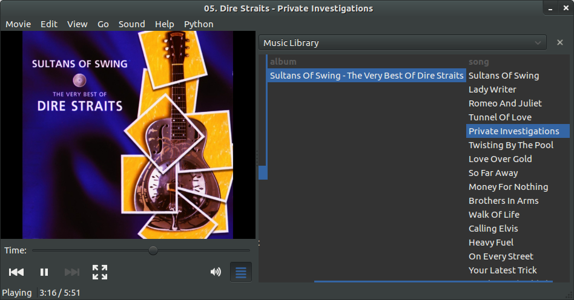

MusicLibrary Totem Plugin
=========================

A music library for [Totem](http://projects.gnome.org/totem/) that uses [Tracker](http://projects.gnome.org/tracker/) as the database.

On the left is a list of the artists in your music collection.
When you select an artist, it lists their albums.
When you select an album, it lists the songs for that album.
When you double click a song, it starts playing.

Install
-------

    # Some of the Ubuntu dependencies:
    sudo apt-get install gir1.2-tracker-0.12 gir1.2-totem-1.0 totem

    mkdir -p ~/.local/share/totem/plugins
    cd ~/.local/share/totem/plugins
    git clone git@github.com:ccouzens/Totem-Music-Library.git musiclibrary

    # start Totem
    totem

Enable the plugin and pay attention to the messages on the command line.
If you needed to install something else, let me know and I'll add to this page

Critique
--------
The user interface doesn't work as well as I had hoped.
Totem's sidebar opens thin so resizing is required to make this usable.
Scrolling horizontally with the trackpad is often picked up by Totem as fastforwarding or rewinding the song.
I'll probably swap the current 3 columns for a single tree view.

The code isn't asynchronous.
This means the plugin could slow down Totem.
It hasn't been a problem in my experience, but I would like to make it asynchronous anyway.

I've not put much thought into how the plugin gets activated and deactivated.
It might be using more resources than it should when the it is deactivated.

When a song finishes it doesn't skip to the next one.

The code repeats itself a lot.
The code for artist, album and song is quite similiar.
